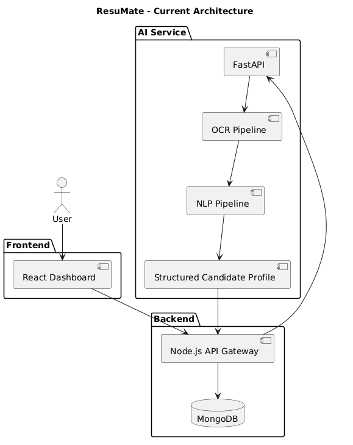
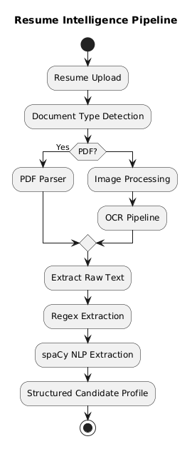

# 🚀 ResuMate

AI-Powered Career Intelligence Platform

## Overview

ResuMate is an AI-powered Career Intelligence Platform designed to go beyond traditional Applicant Tracking Systems (ATS).

Instead of relying solely on keyword matching, ResuMate combines:

- OCR
- NLP
- Candidate Intelligence
- Assessment Generation
- Recommendation Systems
- Predictive Analytics

to transform resumes into actionable career insights.

---

## Current Development Status

### Completed

✅ OCR Pipeline

✅ Resume Parsing

✅ NLP Information Extraction

✅ FastAPI ML Service Architecture

### In Progress

🚧 Candidate Profile Generation

🚧 Assessment Generation Engine

🚧 MongoDB Integration

### Planned

📌 Job Prediction

📌 Salary Prediction

📌 User Clustering

📌 Personalized Learning Roadmaps

---

## Architecture

---

## Technical Documentation

Full project documentation:

[ResuMate Overview](docs/ResuMate-Overview.pdf)

---

## Team

### Shivansh Bhadauriya

AI / ML Engineer

- OCR Pipeline
- Resume Parsing
- NLP Extraction
- Information Extraction
- FastAPI ML Service

### Tejas

Full Stack Engineer

- React Frontend
- Node.js Backend
- MongoDB
- Authentication
- API Gateway

---

## Note

This repository serves as a project showcase and technical documentation portal.

The production source code remains private while the project is under active development.

## Current Development Status

## Current Architecture

## Resume Intelligence Pipeline

